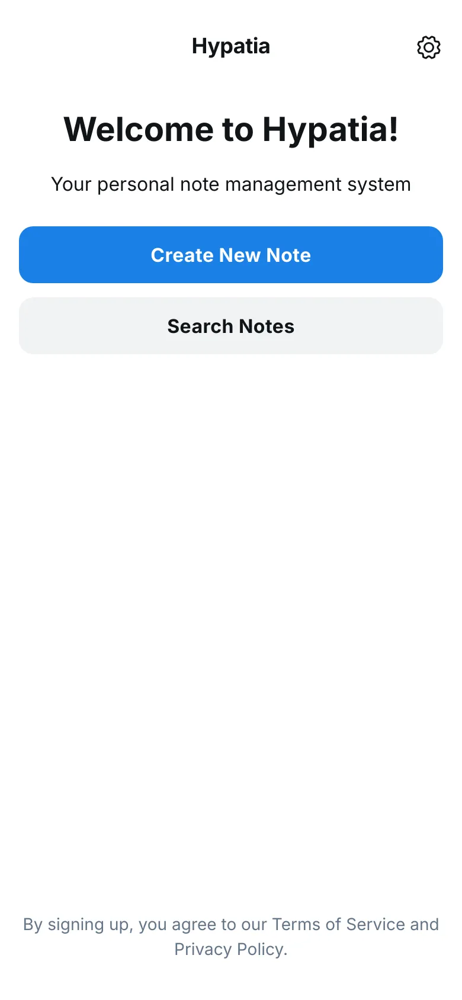
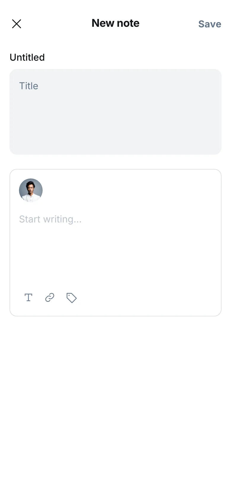
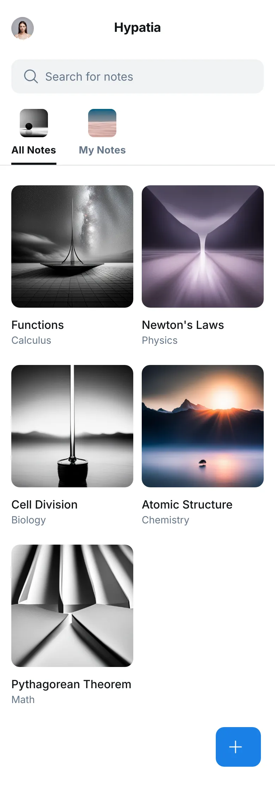
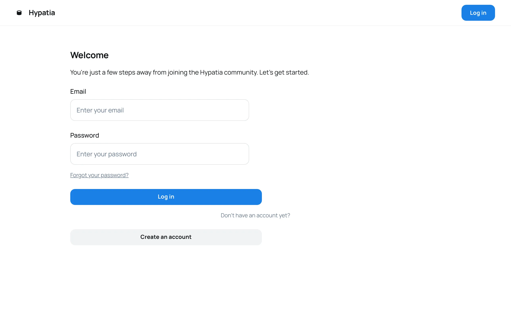
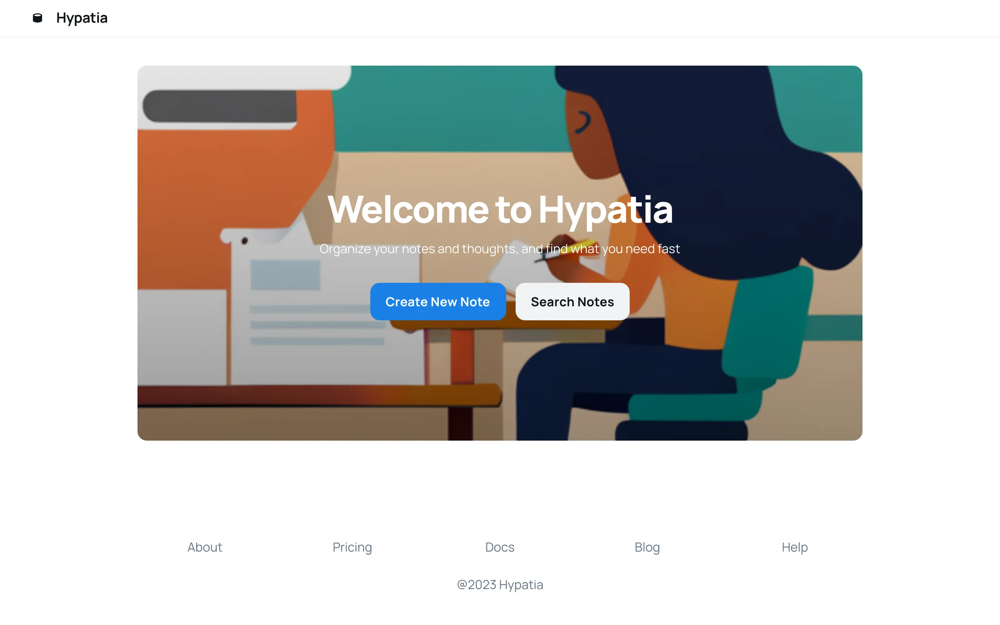
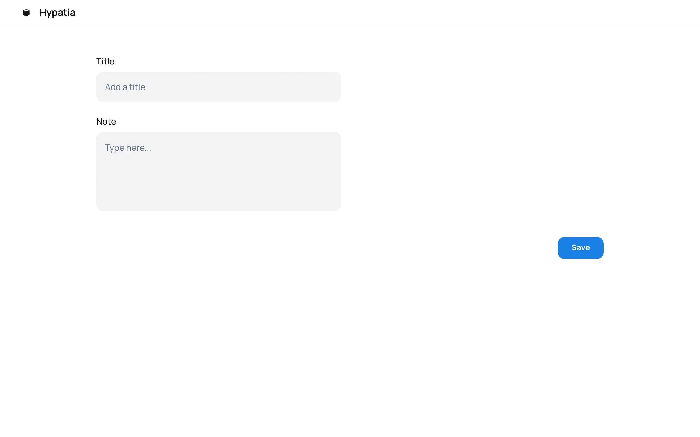
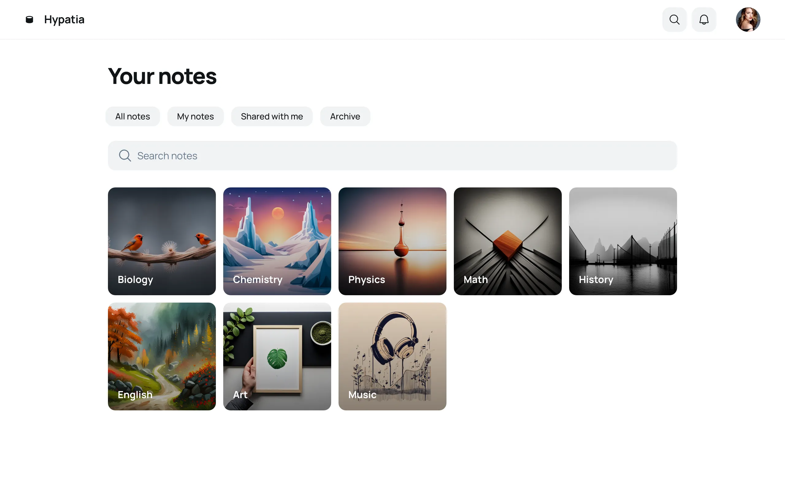

# Hypatia

**Hypatia** es una plataforma de gestión de proyectos y notas para estudiantes, potenciada por inteligencia artificial (IA). Nuestra solución facilita la organización académica automatizando el proceso de digitalización de horarios, creando cuadernos de notas para cada asignatura, y centralizando todo el contenido en un formato digital.

Gracias a la IA, **Hypatia** permite escanear cuadernos físicos y convertirlos en cuadernos virtuales, generar resúmenes automáticos y ofrecer evaluaciones inteligentes basadas en los apuntes. Además, la plataforma incorpora herramientas avanzadas de gestión de tareas, agendas y pendientes, todo almacenado de manera segura en la nube.

Nuestro objetivo es resolver la necesidad de un espacio centralizado, seguro y accesible para gestionar notas, proyectos y tareas, mejorando la productividad de los estudiantes y facilitando el acceso a su contenido académico en cualquier momento y lugar.

---

# Visual Prototypes

Hemos generado una serie de **prototipos visuales** utilizando inteligencia artificial para mostrar el diseño y la funcionalidad de la aplicación **Hypatia**. Estos prototipos fueron creados con la herramienta **galileo.ai** y pueden visualizarse en **Figma** a través del siguiente enlace:

[**Prototipos en Figma**](https://www.figma.com/design/vDNzvVuvJs75V2fQgv7XhA/Hypatia?node-id=1-34&t=UeAZtrVsRSNafben-1)

---

## Prototipos Visuales

### Logo
El logotipo de **Hypatia** simboliza sabiduría y conocimiento, inspirado en la figura de Hypatia, la filósofa y matemática de la Antigua Grecia. El diseño combina elementos educativos y geométricos que evocan organización, claridad y aprendizaje.

---

### Móviles

#### Home Screen
- Pantalla principal con el logotipo de **Hypatia** y opciones de navegación intuitiva.  
  

#### Note Creation Screen
- Interfaz simple para crear y editar notas, con opciones para agregar etiquetas y categorías.  
  

#### Note Organization Panel
- Vista en cuadrícula o lista de las notas, categorizadas por asignaturas, con un buscador integrado.  
  

---

### Web

#### Login
- Pantalla de inicio de sesión simple, con autenticación segura para acceder a las funciones de la plataforma.  
  

#### Home Screen
- Vista principal con menú lateral para acceder a notas, tareas y proyectos.  
  

#### Note Creation Screen
- Editor completo para la creación de notas, con soporte para imágenes, enlaces y formato avanzado.  
  

#### Note Organization Panel
- Panel de organización con vista de notas, ordenadas por asignaturas, con opciones rápidas para editar y eliminar notas.  
  

---

# API REST Service

El servicio **API REST** de **Hypatia** permite la interacción y gestión de datos dentro de la plataforma. Los datos se manejan de forma segura y eficiente, asegurando la confidencialidad y disponibilidad de la información.

### Modelo de Datos:

- **Usuarios**: Incluye datos personales, credenciales y preferencias de configuración.

